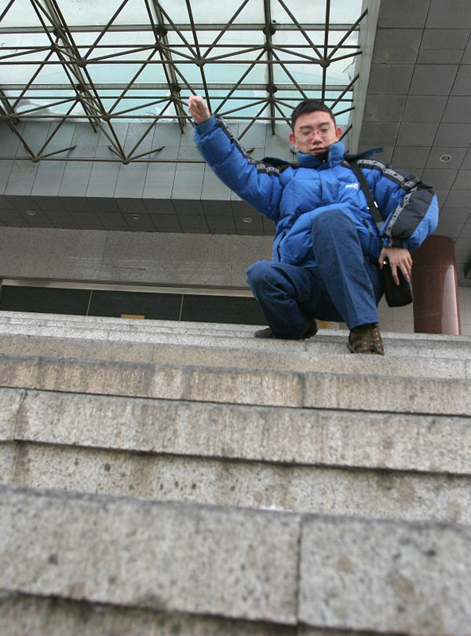

# 一点点介绍

本名李玮，网名里克，从事 SOHO 开发有八年时间了。1984年，因病患“[进行性肌营养不良](http://baike.baidu.com/view/443936.htm)”，2007年开始在家从事 Rails 项目开发工作。

# 一点点照片

2015年，春节，和我儿子

2014年8月，深圳，世界之窗

2014年9月，北京，逛故宫

2014年11月，北京，RubyConf

2005年，创业期间

Updated at 2015-3-1
